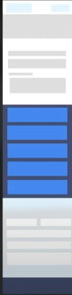
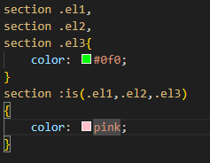
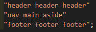
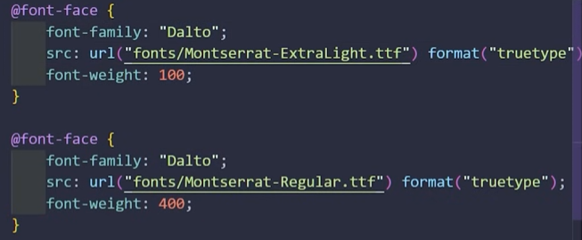
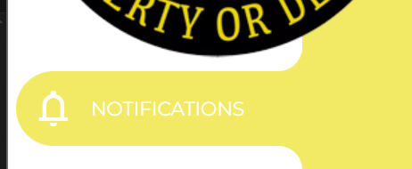

<h1>Curiosidades</h1>

Los mails leen HTML y CSS, por lo que si copiamos y pegamos contenido de una página web, se copiará también su estilo.

<h1>Recursos</h1>

<h2>Extensiones interesantes VSCode</h2>

<u><b>Image Preview</u></b> 
<u><b>Live server</u></b>
 Permite ver tu página web en tiempo real. En la parte de abajo de vsCode (al lado de las líneas) pone un botón Go Live, que abre la página.

<h2>Webs</h2>

[Curvas bezier](https://cubic-bezier.com)

[Meta tags](https://metatags.io)

[Pruebas animaciones scroll](https://scroll-driven-animations.style/tools/view-timeline/ranges/#range-start-name=cover&range-start-percentage=0&range-end-name=cover&range-end-percentage=100&view-timeline-axis=block&view-timeline-inset=0&subject-size=smaller&subject-animation=reveal&interactivity=clicktodrag&show-areas=yes&show-fromto=yes&show-labels=yes)

[Clip paths](https://bennettfeely.com/clippy/)

<h1>Diccionario</h1>

## General

**URI.**

Dirección a un **recurso** o una **página web**.
<b>

lazy loading.
</b>
Carga diferida, básicamente, la página va a ir cargando el contenido según lo vaya necesitando en lugar de cargarlo todo al principio.

**Wireframe.**

Esquema de la distribución de los elementos de la página tanto en PC como en móviles.Ejemplo:
PC:

**Dominio.**

Es el nombre de la página web, el que enmascara la IP.

**SSL.**

Certificado que autentica la identidad del sitio web y habilita una conexión cifrada. Básicamente es lo que mira el navegador para ponerle un candado en la barra de búsqueda para decir que es segura.

**CDN.**

Almacena las copias del contenido estratégicamente alrededor de todos los servidores alrededor del mundo del host. Es decir, al hacer una solicitud, el servidor central va a elegir al más rápido según tu ubicación para servirte el contenido. **En resumen, aumenta la velocidad de carga y reduce la latencia.**. También es bueno para la seguridad, pues ayuda a proteger contra ataques DDOS, que consiste en sobrecargar el servidor.

**Framework.**

Conjunto de librerías para trabajar en un determinado entorno.

## HTML/CSS

<b>
Elementos en línea.
</b>
Aquellos que se agrupan horizontalmente. **Negrita, cursivas, enlaces y span**.

**NO** aceptan margin ni padding verticales para cambiar el tamaño de la caja, ya que se rompen.

**Tampoco** aceptan alto y ancho.

<b>
Elementos en bloque.
</b>
Aquellos que se agrupan verticalmente y que por defecto tienen el **width en 100%**. Son los **párrafos, los h1,h2,etc; y los div**.

Aceptan margin, padding para cambiar el tamaño de la caja.

<b>
shorthand.
</b>
Etiqueta abreviada, atajo

<b>
Margin collapse.
</b>
Efecto que se da al acumularse margins, ya que aunque lo lógico es que se sumen, en realidad predomina el mayor, ahorrando cuentas al desarrollador.

<b>
Ventana modal o modal box.
</b>
Recuadro que aparece sobre la página, con la particularidad de que bloquea todas las funciones y hace que el usuario solamente pueda realizar una determinada acción o cerrar la ventana.

<b>
favicon.
</b>
Icono de la pestaña.

<b>
metatags.
</b>
Etiquetas que van en el <b>head</b> que se usan para dar información de cara al SEO. Importante hacerlas bien.

<b>

Bootstrap 5.
</b>
Librería de metodología BEM con muchas clases modificadoras.

<b>

media-query.
</b>
Solicitud que le hace al dispositivo para obtener cierta información como resolución, etc y cargar unos recursos u otros dependiendo de esto (e.g. un tema). 

<b>

feature-query.
</b>
Es código que podemos escribir en caso de que el navegador soporte una cierta funcionalidad. La sintaxis es:
 

 @supports
 
 (lo que sea){
   
  Código CSS
   
 }

 Se suele usar para usar algo en caso de que lo soporte y otra cosa en caso de que no. (Aquí se usaría 

@supports not

 ).

<b>

container-query.
</b>
Da estilo a los elementos dependiendo de las características de su contenedor.

<b>
wrapper.
</b>
Elemento cuya función es darle un estilo.

<h1>CSS</h1>

Para enlazar HTML con CSS se usa el tag link en el head con rel="stylesheet"
  
La sintaxis CSS es la siguiente:
 

tag a modificar, opcionalmente otro tag
{ 
propiedad : valor<b>;</b> 
propiedad: valor<b>;</b> 
}

El tag a seleccionar se llama <b>selector.</b>
  
En CSS también existe el concepto de <b>clase</b> de POO. El concepto es similar, hacer una plantilla para un elemento en HTML.

Para usar una clase, en el HTML se utiliza el atributo class para decir a qué clase pertenece el elemento, y en CSS se define la clase con un punto delante del nombre, de esta forma:

<b>.</b>clase
{ 
propiedad : valor<b>;</b> 
propiedad: valor<b>;</b> 
}

 
 Se pueden poner varias clases en un mismo elemento separándolas con espacios en el valor de 

 class.
 

En CSS también hay herencia, es decir, que los tags que sean hijos de otro heredarán el estilo del padre. De hecho, a los atributos podemos darle el valor <b>inherit</b>, es decir, que herede el valor de alguno de los padres. 
 
También podemos darle el valor **initial**, que sería el valor por defecto del navegador.

El valor **unset** es no especificar nada y el valor **revert** es buscar el valor del tema del navegador, y si no hay ningún tema aplicado el por defecto.

 Además de las clases, existen los <b>id</b>, que están pensados para seleccionar elementos únicos, de forma que <b>uno y sólo uno de los elementos de la página</b> debe tener <b>un id en particular</b>. Su función es identificar al elemento de cara a ser utilizado en código javascript.
 
 Se redefinen en CSS con un **#** delante en lugar del punto que utilizamos en la clase.

Podemos crear **variables** con 

--nombre : valor ;

Y después la referenciamos con la función

**var( nombre de la variable ).**

Las variables se pueden usar en **cualquier elemento** hijo del elemento en el que se creó, por lo que **lo normal es declararlas en el body** y si algún elemento y sus hijos se va a comportar diferente redefinirlo en ese elemento, pues sólo se van a ver afectados él y los hijos.
 
 También podemos crear propiedades con esta sintaxis:
 

@property --nombre{
   
  syntax: "< tipo de la variable. Por ejemplo number>";
   
  inherits: true o false;
   
  initial-value: valor;
   
}
 

 
 <h2>Cascada y especificidad</h2>

El orden de prioridad en que se selecciona un elemento viene dado por la cascada y, una vez seleccionado en cascada, si hay conflictos, viene dado por la especificidad del elemento.

La cascada aplica el siguiente orden de prioridad, de menor a mayor:

 - Estilo definido por el navegador.
 - Estilo definido por el tema del navegador
 - Estilo definido en un archivo CSS **o** usando el tag

< style>.

 
 - Estilo definido usando el atributo 

style.

 - Estilo que tenga el marcador **!important**, esté donde esté.

Dentro de lo elegido por la cascada, si hay conflictos, pasa a elegir por especificidad, es decir, qué elementos son más **específicos**.

El orden en este caso de menor especificidad a mayor sería **elementos generales < clases < id**, o como lo referenciaríamos en CSS, **h1 < .clase_titulo < #titulo_razas_de_perro** .

La especificidad se puede ver en Chrome como una tupla de tres valores con 1 y 0 al pasar el ratón por encima de un selector. Mientrás más a la izquierda esté el 1, más específico es. Si usamos selecotres avanzados podemos tener varios 1, siendo más específicos que si usamos selectores simples.

En caso de que haya dos elementos con la **misma especificidad**, elegirá el **último de ellos**.

<h2>Propiedades de texto más usadas</h2>

<b>Las propiedades que modifican la posición, tamaño, etc, lo hacen dento del tamaño de su contenedor.</b>

<b>

color
</b>

<b>
font-family
</b>
La font que queremos. Si tiene varias palabras el nombre, la ponemos entre comillas como si fuera un string. <b>Podemos poner varias, separadas por comas, y el navegador tratará de cargar la primera, si no puede intentará con la segunda y así sucesivamente.</b>
 
<b>
font-size
</b>
El tamaño del texto, el default es 

16px.
 Se puede medir en px, mm, porcentajes,etc.

<b>
font-weight
</b>
El grosor de la letra. Para poner el texto en negrita se recomienda usar esto con el valor 

bold

en lugar de la etiqueta 
<b>< b>
</b>. Cada font tiene varios niveles de grosor del 100 al 900 y se puede elegir, aunque la mayoría no los tiene todos definidos así que buscará el más próximo.

<b>
font-style
</b>
.La inclinación de la fuente, 

normal < oblique < italic

 Hay una función experimental que permite inclinarla el número de grados que queramos, usando deg. p, ej. 

40deg.

<b>
text-align
</b>
Permite alinear a la izquierda, derecha, centro o justificado.
 
Podemos usar también 

start

o

end
 para adaptar la alineación al idioma del país desde el que se acceda a la página. Por ejemplo, desde un país árabe escogerá 

right

 automáticamente.

<b>
text-decoration
</b>
Es el estilo de subrayado. Se pueden poner varios, por ejemplo tachado y subrayado, además de cambiar el color y grosor de la línea simplemente separando los valores con espacios. <b>NO </b> usar 

blink

, está obsoleta.

<b>
line-height
</b>
Interlineado. 1 es el tamaño de un carácter.

<b>
letter-spacing
</b>
Espaciado entre caracteres. Se usa bastante en botones.

<b>
text-transform
</b>
Transforma el texto a minúscula, mayúscula, o incluso otras opciones especiales, como

<b>

list-style.
</b>
Es el icono de los puntos de las listas desordenadas.

capitalize
, que pone la primera letra de cada palabra en mayúscula, o 

full-size
, para alfabetos especiales como el japonés.

<b>

direction.
</b>
Dirección de lectura del texto. Puede ser 

ltr

(left to right) o

rtl

(right to left).

<b>

white-space.
</b>
Define cómo se comportan los espacios en blanco.

normal
 
hace que cuando haya overflow haga un salto de línea.
 

nowrap

hace que no haya saltos de línea.
 

pre

pone los mismos saltos de línea que el editor.
 

pre-wrap

es una mezcla entre **normal** y **pre**.

<b>

text-overflow.
</b>
Dicta qué hay que hacer con el texto que se desborda, siempre y cuando el 

overflow

no esté en 

display.

Los valores son 

clip
 por defecto, que recorta el overflow, y

ellipsis,

que pone puntos suspensivos.

<b>

word-break.
</b>
Define cómo dividir las palabras cuando se desbordan.

break-all

recorta la línea justo donde no cabe, sin tener en cuenta si forma parte de una palabra.
 

keep-all

en idiomas como el coreano evita la ruptura de palabras.
 

auto-phrase

Evita cortar las frases cuando mete el salto de línea.

<b>

overflow-wrap.
</b>
Dicta por dónde se rompen las palabras cuando hay overflow.

anywhere

rompe por cualquier sitio.
 

break-word

rompe teniendo en cuenta las sílabas.
 

balance

intenta romper de forma que el texto quede dividido de forma más o menos uniforme o balanceada.
 

pretty

intenta que no se queden palabras solas.

<h3>

Propiedad display

</h3>

Hay varios valores que podemos darle a display para cambiar el tipo de elemento:

inline.

Hace que el elemento pase a ser en línea, es decir, no acepta padding ni margin, y se apilan horizontalmente.

block.

Hace que el elemento sea en bloque, es decir, acepta padding, margin, width y height, se apilan verticalmente y por defecto tienen width 100%, es decir, **ocupan todo el ancho de la página.** e **inician una nueva línea.**

inline-block

Funcionan igual que los elementos en bloque, pero **NO ocupan todo el ancho disponible NI inician una nueva línea.**

none.

El elemento pasa a no ocupar espacio en la página y a **NO** renderizarse. Además, **NO** se cuenta en el cómputo de elementos hermanos, etc.

<h3>Posicionamiento</h3>

Para esto se utiliza la propiedad 
<b>
position.
</b>

Esta propiedad nos permite crear un contexto de apilamiento, es decir, una especie de "Eje Z" para los elementos de forma que estén unos encima de otros y se puedan superponer entre sí.

En la práctica, esto quiere decir que a los elementos que están posicionados les empiezan a afectar ciertas propiedades como el 

z-index, 
 
que dice dónde están en el eje Z. Se suelen poner de 10 en 10 aunque no es necesario hacerlo así.

Aparecen ademas las propiedades

top, bottom, left y right.

para mover los elementos en el renderer.

 
top
 
 y

  left

 tienen prioridad sobre

bottom

y

right

, respectivamente.

Los posibles valores son:

relative.

Mantiene su **posición original** en el DOM, pero **permite renderizar el elemento desplazado** con las propiedades 

top, bottom, left y right.

y además se convierte en un **pivote** para los elementos hijos.

absolute.

El elemento **deja de ocupar espacio en la página**, aunque sigue renderizándose ahí. Todo lo que movamos el elemento en el renderer será en **posiciones absolutas** siendo el punto **pivote** por defecto el lado **superior izquierdo**, aunque **si tiene un padre en 

relative

, lo usará como pivote.**
 
Esto último es útil ya que de esta forma, con 

left

en 0 se posicionará en el extremo izquierdo del contenedor,

bottom

en 0 se posicionará en el extremo inferior del contenedor, etc.

**Si le damos 0 en las cuatro propiedades y 

margin

auto**, se centrará el elemento. 

static.

Es el por defecto, no se considera posicionado, pues no se puede mover a no ser por el margin.

fixed.

Es exactamente igual que el absolute, pero con la diferencia de que **se posiciona con respecto a la ventana** en lugar de con respecto al padre.
 
De hecho, al hacer scroll, va a seguir al scroll.

sticky.

Es como relative, pero cuando hay scroll usa 

top, bottom, left y right

como **tresholds** antes de tener el comportamiento de 

fixed. 

Es decir, si por ejemplo, le ponemos 10px de 

top

, cuando al hacer scroll llegue a los 10 píxeles de arriba de la pantalla, de ahí para abajo va a acompañar al scroll.

<h2> Funciones más usadas</h2>

<b>

url (

link

)

</b>
Devuelve lo que haya en la url referenciada por el parámetro

link.

<b>

linear-gradient ( 

degs, color1 perc, color2 perc, colorn perc

)

</b>
Devuelve un degradado lineal con 

deg

grados y tantos colores como se les suministren en los porcentajes dados.

<b>

radial-gradient ( 

shape 

at

position, color1 perc, color2 perc, colorn perc

)

</b>.
La 

shape

puede ser un 
 
circle

o una
 
elipse.

<b>

conic-gradient(

color1, color2, color n

)
</b>

**clamp (min, ideal, max ).**

Sobre todo se usa para anchuras o alturas. Si el elemento mide menos de 
min
, se queda con 

min,

 si mide más de 
 
 max,
  se queda con 
 
 max.
  En caso contario se queda con 
 
 ideal.
 

 También se usa bastante para dar tamaño a **las fonts.** Se ponen las medidas mínimas y máximas en rem y las ideales en vw.

**calc().**

Permite realizar cálculos aritméticos con sumas, restas, multiplicaciones, divisiones y otras funciones.

**color-mix ( method, color percentage, color percentage, etc )**
.
Mezcla los colores usando el método (puede ser 

hsl, srgb,
 entre otros).

<h3>Funciones de Filtro</h3>

<b>

drop-shadow(

horizontal vertical size color

).
</b>
Filtro que aplica una sombra a las imágenes sin fondo basadas en los bordes de la misma usando un kernel. Útil para logos, por ejemplo.

**brightness( b ).**

Multiplica el brightness del elemento por 

b.

**contrast( c ).**

Igual que el anterior pero con el contraste.

**saturate( s ).**

Igual que el anterior pero con la saturación.

**grayscale()**

Convierte el contenido a escala de grises.

**hue-rotate( degs ).**

Rota en el tono. Se utilizan grados, por lo que de 0 a 360.

**opacity ( o ).**

Aplica opacidad.

**invert().**

Invierte los colores.

**sepia()**

<h3>Funciones de la propiedad Transform</h3>

**scaleX( sc ).**

Escala en X. También lo hay en el resto de ejes y general.

**skew( degs ).**

Le hace una transformación itálica.

**rotate( degs ).**

Rota el elemento. Podemos hacer que sea como rotar un sprite en 3D si usamos las funciones del resto de ejes.

**translate( h , v ).**

Mueve el elmento.

**perspective( px ).**

Mueve el punto de fuga

px

píxeles hacia atrás.

**backface-visibility.**

Es si se ocultan o no las caras traseras en 3D. Por defecto se muestran.

**mix-blend-mode.**

Son los modos de fusión como los de Photoshop o Nuke.

<h2>Selectores avanzados</h2>

Una forma de conseguir selectores de un elemento es en inspeccionar->Elements->copy->copy selector.

Por otra parte, los selectores se pueden encadenar unos con otros:
 

<b>
[ 

atributo = "valor"

]
</b>
selecciona en base a un valor concreto de un atributo.

 Si al atributo <b> le añadimos $</b> seleccionará aquellos atributos que <b>terminen</b> en lo que escribamos.

Si <b> le añadimos ^</b> seleccionará los que **empiecen** con lo que escribamos.

<b>
tag1, tag2
</b>. Al separar por comas, aplicamos el estilo a todos los 

tag1 

y

tag2

.

<b>
tag_padre tag_hijo
</b>
.Al separar por espacios, le damos estilo a todos los tags que se llamen 

tag_hijo 

y que sean hijos **directos o indirectos** de tags que se llamen

tag_padre.

<b>
tag_padre > tag_hijo
</b>
Usando <b>></b> seleccionamos a los 

tag_hijo

que sean hijos <b>directos</b> de

tag_padre

.

 
<b>
tag_anterior + tag
</b>
.Selecciona al primer tag que se llame 

tag

que esté justo después de un tag 

tag_anterior.

 
<b>
tag_anterior ~ tag
</b>
.Selecciona a todos los tags que se llamen 

tag

que estén después de un tag 

tag_anterior.

<h2>Pseudo-clases</h2>

Son funciones o atributos que marcan estados concretos a la hora de seleccionar un elemento. En la <a href ="https://developer.mozilla.org/es/docs/Web/CSS/Pseudo-classes">documentación</a> podemos encontrarlas todas, pero algunas de las más comunes son las siguientes:

<b>

:root
</b>
.Es la raíz de todo el documento. Todo hereda de ello. Se pone sin ningún atributo específico.

<b>

:hover
</b>
.Cuando el ratón está encima del elemento.

<b>

:active
</b>
.Cuando se está clickando el elemento.

<b>

:first-child
</b>
.Elige al primero de los elementos hermanos.

<b>

:last-child
</b>
.Elige al último de los elementos hermanos.

<b>

:nth-child( expresión )
</b>
. Elige a uno de los elementos hermanos en base a una expresión con la n. Por ejemplo,
 
2

elige al segundo hermano, pero
 
2n + 1

elige a los hermanos impares.

<b>

:nth-of-type ( expresión )
</b>.Elige a uno de los elementos hermanos que sea del tipo concreto del selector en base a una expresión con la n.

<b>

:not( selector)
</b>
.Elige a todos aquellos elementos que no sean seleccionados por el 
selector.

<b>
:empty
</b>
.Elige a todos los elementos que estén vacíos y no formateados, es decir, la única forma de elegirlos es que tengan esta forma (sin espacios):
 
< tag>< /tag>.

Puede servir para por ejemplo darle un borde a un elemento, pero si está vacío quitárselo.

<b>

:checked
</b>
.En una checkbox, la elige si está marcada.

<b>

:link
</b>
.Selecciona un enlace que **NO** está visitado.

<b>

:visited
</b>
.Selecciona un enlace que **YA** esté visitado.

<b>

:focus
</b>
.Selecciona un elemento si tiene el foco.

<b>

:enabled
</b>
. Selecciona un input si está activado, es decir, puede recoger input.

<b>

:disabled
</b>
. Selecciona un input si está desactivado.

<b>

:fullscreen
</b>
. Selecciona un elemento solo en modo pantalla completa.

<b>

:invalid
</b>
. Selecciona un input cuyo valor dado por el usuario es incorrecto, por ejemplo, un email sin el @. También está la pseudo-clase 

:valid.

<b>

:is ( elementos )
</b>. Agrupa elementos para no tener que repetirlos cuando usamos selectores avanzados. Por ejemplo, en el siguiente caso, el color rosa y el color verde están seleccionando los mismos elementos.
 

 
**Cambia la especificidad**, pues hace los elementos **más específicos.**

<b>

:where( elementos )
</b>
. Es igual que is, pero **NO** cambia la especificidad.

<b>

:has ( elementos )
</b>
.Selecciona aquellos objetos que sean padres de los 

elementos

del argumento.

<h2>Pseudo-elementos</h2>

Son los componentes de los elementos, por ejemplo, los placeholder de los inputs. **Sólo se les pueden modificar ciertas propiedades dependiendo del pseudoelemento.**

Los más importantes son:

<b>

::first-letter
</b>
.La primera letra del elemento.

A esta le podemos dar la propiedad
**initial-letter.**
,que recibe dos valores, las líneas que va a ocupar de alto, y a partir de qué línea va a aparecer.
<b>

::first-line
</b>
.La primera línea del elemento.

<b>

::selection
</b>
.El texto (u otros elementos) que seleccionamos con el ratón.

<b>

::placeholder
</b>

<b>

::marker
</b>
.Los puntos de las < ul>.

<b>

:before
</b>
.Lo que hay antes del elemento.

<b>

::after
</b>
.Lo que hay después del elemento.

Una de las propiedades que se pueden cambiar exclusivamente en los pseudo-elementos es:

<b>

content
</b>
.Contenido en general, puede usarse para cambiar un texto por otro.

<h2>Transiciones</h2>

Podemos controlar los siguientes aspectos de las transiciones con propiedades.

<b>

transition-property.
</b>
Es la propiedad que queremos que transicione, como por ejemplo, el 
 
color.

**NO** se recomienda poner 
 
all

por ser muy ineficiente.

<b>

transition-duration.
</b>
Podemos hacer que sea distinta en el estado al que estamos transicionando, lo que hará que dure distinto al pasar a ese estado que al volver de ese estado.

<b>

Transition-delay.
</b>

<b>

transition-timing-function.
</b>
Controla la curva de animación. Podemos darle valor 
 
linear, ease

y todas sus variantes, o crear curvas bezier con la función
 
bezier.

Para ajustarlas visualmente usaremos la página [cubic bezier](https://cubic-bezier.com) o desde las herramientas del desarrollador de chrome.

Otra opción es usar la función

steps()
, que nos permite darle un número de saltos en los que se dividirá la transición.

El [shorthand](#Shorthand) para las transiciones es
<b>
transition
 
properties time function delay

</b>
 
Se pueden separar por coma.

<h2>Animaciones</h2>

 La sintaxis es parecida a las [media queries](#mq). Sería:

@keyframes

nombre
{ 
  0%{ 
    propiedad: valor; 
    propiedad: valor;
  } 
  ... 
  ... 
  100% { 
propiedad: valor 
propiedad: valor 
  } 
}

Para mostrar la animación, hay que darle valor a las siguientes propiedades:

**animation-name.**
 El nombre que le hemos dado en la parte de arriba.

**animation-duration.**

Además, se pueden usar otras propiedades:

**animation-delay.** 

Un retardo en la animación.

 
 **animation-iteration-count.**
 
 Número de iteracciones. Se puede usar el valor
 
infinite.

**animation-fill-mode.**

Cómo se queda la animación al terminar. Posibles valores:

 

forwards.

Se queda igual que termina.
 

backwards.

Se queda como al inicio.
 

both.

Es como forwards pero por defecto toma los valores del primer estado en lugar de los definidos en el CSS normal. Esto se ve sobre todo si hay algún delay en la animación. **Es el que se suele usar.**

**animation-timing-function.**

La función que sigue para dar curvas. Igual que en las [transiciones.](#transitionFunction)

**animation-direction.**

 

reverse. 

La animación se reproduce al revés.
 

alternate.

La animación se reproduce y cuando termina se reproduce otra vez al revés.
 

alternate-reverse.

Se reproduce al revés y cuando termina se reproduce normal.

**animation-play-state.**

 

paused

o
 
running.

**animation-timeline.**

Disponible solo en algunos navegadores, permite controlar el avance de las animaciones con el scroll. **Si se usa no poner animation-iteration-count. y el position en  fixed.** Tiene varios valores:
 

scroll().

Controlas la animación en base al scroll general de la página.

Otra opción es usar el nombre del elemento de la página que queramos **(que no sea el body)**, en el cual habría que usar las propiedades scroll-timeline-name y scroll-timeline-axis.
Para usar esta técnica es importante que **el contenido a animar sea mayor que el contenedor** y hay que poner el 

overflow

en 
 
scroll.

**scroll-timeline-name**.

El nombre que le vamos a dar al elemento para usarlo de scroll

**scroll-timeline-axis.**

 
inline
 es el eje horizontal y
 
block

el vertical.

El [shorthand](#Shorthand) para estos dos es 

**scroll-timeline.**

 

view().

Controlas la animación en base al scroll general pero en la parte de la página en la que se ve, es decir, mientras vas haciendo scroll empieza a reproducirse cuando se empiece a ver el elemento hasta que salga de la vista. Obviamente, **aquí no tiene sentido usar position  fixed.**

Usando

**view-timeline**

con los mismos valores que [scroll-timeline](#sctml) en cualquier otro elemento, podemos hacer que la animación se reproduzca según la visibilidad de ese otro elemento.

Podemos controlar los límites a partir de los cuales el elemento se considera que se se empieza y termina de ver (es decir, a partir de cuándo empieza y termina la animación) con 

**animation-range-start.**

Habría que decirle el comportamiento y el treshold en porcentaje a partir del cual empieza. P. ej. 
 
cover 20%
.
Los comportamientos más usados son:

 

cover.

Cuando el elemento empieza a verse, aunque solo sea el borde.
 

contain.

Cuando todo el elemento es visible.

 

exit-crossing.

Cuando el elemento se está yendo de la pantalla.

**animation-range-end.**
 Igual que el anterior pero cuando el elemento desaparece de pantalla.

Ambos son compatibles con 

animation-fill-mode.

El [shorthand](#Shorthand) para ambos es

**animation-range.**

Podemos previsualizar y hacer pruebas [aquí](https://scroll-driven-animations.style/tools/view-timeline/ranges/#range-start-name=cover&range-start-percentage=0&range-end-name=cover&range-end-percentage=100&view-timeline-axis=block&view-timeline-inset=0&subject-size=smaller&subject-animation=reveal&interactivity=clicktodrag&show-areas=yes&show-fromto=yes&show-labels=yes)

<h2>Box Model</h2>

Es un paradigma de CSS que define cómo poner los elementos de una página web.

Cada elemento sería una caja rectangular y este paradigma dicta cómo se redimensionan, interactúan entre sí, etc.

Cada caja tiene un <b> content</b>, que es lo que hay dentro, es decir, el texto, la imagen o lo que sea.

Las cajas también tienen un <b>border</b>, que es el contorno de la caja. Se puede configurar el estilo, el color y el grosor, un <b>padding</b>, que es el espacio entre el contenido y el border, y un <b>margin</b>, que es el espacio en blanco alrededor de la caja, y separa el elemento de los demás. <b> El margin NO forma parte de la caja. </b>
Además, hay un **outline** entre el border y el margin.

Las propiedades que se pueden modificar son:

<b>
Contenido
</b>
 
Width y Height. 
<b>Cuidado, porque pueden descentrar el conteido.</b>

<b>
Padding y margin
</b>
 
left, right, top y bottom. **Si les damos el valor  auto , se le dará como valor en esa dirección el espacio sobrante.**

<b>
Border
</b> 
width, radius y sizing.

<b>

Outline
</b>
 
outline-color, outline-style, outline-width, outline-offset.
 
El outline **NO** cambia el tamaño de la caja, es puramente visual, por lo que **es genial para transiciones, hovers, etc**.
 
Si queremos quitar el outline cuando el elemento tenga el foco, por accesibilidad hacerlo **en :focus-visible y NO en :focus**.

<h3>Box sizing</h3>

Hay dos modelos a la hora de calcular los tamaños de las cajas, el 
 
content box

,que es el default, le aplica el tamaño que le demos a la caja únicamente al 
 
content
 

,por lo que los tamaños del padding, border y margin serán un extra.

El otro es el 
 
border box

, que le aplica el tamaño de la caja al 
 
border

, haciendo que el contenido y el padding se ajusten dentro de ese tamaño.

En resumen, si elegimos 
 
content box

, todo lo que le agreguemos al content hará que la 
 
caja crezca

, mientras que si elegimos 
 
border box

,
 
 mantendrá su tamaño

 a pesar de que le agreguemos cosas.

<h3>Propiedades interesantes Box Model</h3>

<b>
padding
</b>
Define el padding en el sentido de las agujas del reloj  empezando por arriba separado por espacios. Tiene varios [shorthands](#Shorthand). También podemos poner solo dos valores que serán el vertical y el horizontal.

<b>
margin
</b>
De igual forma que el padding, define el margin, que separa las cajas entre sí.
  Si usamos auto lo centra horizontalmente con respecto a su contenedor.

<b>
border
</b>
hay varias propiedades del borde, pero como mínimo deben estar definidas
 <b>
border-width, border-color y border-style.
 
</b>
Uno de los estilos, 
 
hidden,

oculta el borde para poder mostrarlo posteriormente por código, aunque modifica el tamaño.
Para que no se modifique el tamaño podríamos usar
 
transparent.

 
 <b>
border-radius
</b>
redondea los bordes tantos píxeles como queramos (o porcentaje, que redondea usando también parte de los lados verticales). Al igual que el margin, podemos ponerle varios valores para que cada uno afecte a cada una de las esquinas del borde. Si solo ponemos dos, lo hará en diagonal de izquierda a derecha.

El [shorthand](#Shorthand) 
 <b>
border
</b>
se usa para sustituir las tres propiedades imprescindibles del borde y se dan en el siguiente orden: <b>width style color</b>.

Se pueden modificar cualquiera de los lados del borde por separado con 
 <b>
border-top,border-right, etc
</b>
y los valores de anchura, estilo y color en el mismo orden.
 
Lo mismo sucede con los radios, pudiendo hacer formas redondeadas un poco más personalizadas.

 <b>
box-sizing.
</b>

 
border-box

o
 
content-box

.

 
 <b>

filter.
</b>
Aplica filtros al elemento.

**backdrop-filter.**

Aplica filtros a lo que hay detrás del elemento.
 <b>

border-spacing.
</b>
Se  usa sobre todo en tablas, separa los bordes entre sí.
<b>

overflow.
</b>
Controla lo que sucede cuando algo no cabe en un elemento. Puede ser
 
visible, hidden, clip, scroll

o
 
auto

, que pone el scroll cuando hace falta.
 
  La diferencia entre
 
clip

y
 
hidden

es que el último reserva un poco de espacio para las barras de scroll aunque no se vean.

 <b>

object-fit.
</b>
Define qué hacer con imágenes y videos reescalados.

fill

rellena el contenido, aunque no se respete el aspect ratio original.
 

contain

respeta el aspect ratio original o bien por horizontal o por vertical y rellena el espacio que sobra con padding.
 

cover

mantiene el aspect ratio original recortando el contenido que se desborde.
 

none

evita que se reescale.
 

scale-down

elige entre las anteriores de forma que la imagen quede lo más pequeña posible.
 <b>

object-position.
</b>
Tiene sentido cuando 
 
 object-fit
 
 está en 
 
cover.
. Dice qué parte del contenido es la que se va a ver. Puede ser 

top, center, bottom, left o right.

 
También podemos darle 

píxeles

como valor.

**scroll-behavior**
 Cambia el comportamiento del scroll, si queremos que afecte a toda la página habría que aplicarlo a *. Los valores son:

auto.

Valor por defecto, el scroll se desplaza inmediatamente.

smooth.

Suaviza el scroll y cuando **hacemos enlaces a seciones de la web** hace que **baje la barra** en lugar de "teletransportarse".

**scrollbar-color.**

Color de la barra de scroll. Hay que darle **dos colores**, primero el foreground y luego el background.

**scrollbar-width.**

Tiene tres posibles valores:

auto.

Tamaño normal.

thin.

Más pequeña.

none.

Invisible, permite hacer scroll con el ratón (o con el dedo en móviles).

**clip-path.**
Crea una máscara. Podemos personalizarla con un [generador](https://bennettfeely.com/clippy/).

**user-select.**
 Permite decidir si queremos que el usuario seleccione o no el elemento.
<h3>Fondos</h3>

 <b>
background-image.
</b>
podemos usar varias funciones para darle valor. Con la función 

url

le damos el valor de una imagen, con la función 

linear-gradient

o

radial-gradient

le damos un degradado.

Además, podemos poner **varias capas** separándolas por comas en orden descendiente, por ejemplo, una capa de degradado con un negro transparente y otra capa con una imagen para oscurecer la imagen

 <b>
background-size.
</b>
Si le damos un
 
porcentaje

, reescala la imagen (o lo que haya de fondo) para que la anchura ocupe ese tanto por ciento del contenedor.
 
También podemos darle
 
 medidas absolutas.

 
 
 
contain

obliga al contenedor a que la imagen quepa al menos una vez, aunque luego se repita.
 
 
 
cover

hace que la imagen ocupe todo el contenedor, pudiendo incluso cortarse. La diferencia con dar 
 
100%

es que este último repetirá la imagen.

 <b>
background-position.
</b>
 
left, right, top, bottom o center.

Alinea el fondo.
También se le puede dar un número de pixeles en positivo o negativo para derecha y otro para abajo.
 
 <b>
background-repeat.
</b>
Controla si queremos que se repita la imagen de fondo o no.

 <b>
background-attachment.
</b>
Controla cómo scrollea la imagen de fondo con respecto al scroll general de la página.
 
 
fixed

deja el fondo fijo con respecto al scroll, de forma que cuando se scrollee la página dará la impresión de que se mueve.

 
scroll

es el valor por defecto. La imagen de fondo se mueve con el scroll, por lo que da la impresión de estar fija.

 
<b>
background.
</b>
[shorthand](#Shorthand) para todo lo anterior. El orden de los atributos es 
 
image position / size repeat attachment color.

 
<b>Entre 
 
position

 y 
 
size

hay que poner siempre la barra /.</b>

<h3>Sombras</h3>

<b>
box-shadow.
</b>
Controla las sombras de las cajas, hay que pasarle 
 
tamaño horizontal, tamaño vertical ,tamaño del blur, longitud o separación y color.

<b>
text-shadow.
</b>
Igual que el anterior pero <b>sin</b>
 
longitud o separación.

<h2>Flexbox</h2>

Es otro modelo de cajas, en este caso las cajas van a a adaptar su tamaño (**sin tener en cuenta el padding**) al tamaño de la ventana (**Solo pueden disminuir su tamaño por defecto**). Para usarlo, a un elemento padre le daremos a la propiedad

display

el valor
 
flex, block-flex

o
 
inline-flex.

  
De esta forma, las cajas contenedoras se comportarán en bloque, pero sus hijos **directos** serán flexibles.

Si vamos a hacer **mails** en HTML, **NO** está soportado. Usar [tablas](#tables) en su lugar.

Los elementos flexibles apuntan todos en una misma dirección, que se puede definir y hay dos ejes, el **main axis**, que es si están en horizontal o vertical, y el **cross axis**, que es el orden.

Los hijos toman por defecto el tamaño para ocupar todo el **cross axis.**

Tenemos distintas propiedades que podemos modificar.

<h3>Propiedades para los padres</h3>

<b>

flex-direction.
</b>
 
 
row.

En horizontal, dirección de lectura (izq -> der).
 
 
row-reverse.

En horizontal, dirección contraria a la lectura (der -> izq).
 
 
column.

En vertical, dirección de lectura (arr -> aba).
 
 
column-reverse.

En vertical, dirección conraria a lectura (aba -> arr).

<b>

flex-wrap.
</b>
Determina si los elementos hijos pueden hacer saltos de linea.
 
 
wrap

los permite, mientras que 
 
nowrap

(que es la por defecto), **NO** los permite.
 
Podemos usar sus versiones reverse para dar la vuelta al revés.

<b>

flex-flow.
</b>
Es un [shorthand](#Shorthand) para los dos anteriores.

<b>

justify-content.
</b>
Posiciona los elementos en el **main axis.** Puede ser
 
start, center, end

u otras especiales como:

 

space-between.

Pone el primero en el principio, el último en el final y el resto los distribuye de forma equitativa.
 
 
space-around.

Distribuye de forma equitativa **TODOS** los elementos. Esto provoca que los elementos del medio tengan el doble de espacio que el primero y el último.
 
 
space-evenly.

Igual que el anterior pero ahora **TODOS** van a tener el mismo espacio.

<b>

align-items.
</b>
Posiciona los elementos en el **cross axis.** Úil cuando hay sólo **una línea**
Los valores que toma son:

 

stretch.

Los elementos se estiran para llenar el contenedor.
 
 
start.

Los elementos mantienen el tamaño y se ponen al principio de su línea (o columna). Pasa lo mismo con 
 
center

y
 
end.

 
 
baseline.

Intenta alinear el texto de dentro. Se nota más cuando hay distintos tamaños.

<b>

align-content.
</b>
Igual que el anterior pero para **múltiples líneas**.
 
**También toma los valores de justify-content**.

<b>

order.
</b>
Cambiamos el orden de renderizado de los elementos (**NO afecta al DOM.**). Los valores son de 0 a n **pero todos los elementos tienen que tenerlo definido**.

<b>

gap.
</b>
Asigna un espaciado entre elementos. Pueden salirse del flexbox.

<h3>Propiedades para los hijos</h3>

<b>

flex-grow.
</b>
Es un número que representa la proprción del espacio **sobrante** que puede crecer, teniendo como tope el

flex-basis.

  
**Por ejemplo**, si todos los hijos tienen 
 
1

y el primero tiene
 
2,

el primero va a crecer hasta ocupar el doble de espacio **en blanco** que el resto.
 
Básicamente se suman todos los flex-grow y cada elemento tiene tantas partes del total como indique el atributo.

<b>

flex-shrink.
</b>
Determina cuánto se pueden encoger los elementos.
 
0

es que no se encogen. En cuanto al resto es igual que 

flex-grow.

<b>

flex-basis.
</b>
Es el tamaño base del elemento en la dirección en la que apunta. Si la ventana reduce el elemento a menos de este tamaño empieza a aplicar las políticas del 

flex-shrink

y si la ventana se agranda a más de este tamaño aplica las del 

flex-grow.

**Es necesario definirlo para que funcionen los anteriores.**

El [shorthand](#Shorthand) para estas tres en ese orden es 

flex.

<b>

align-self.
</b>
Overridea el 

align-items

del padre. (No funciona con 

align-content)

<h2 id="grid">Grid</h2>

V

Al igual que flexbox, es modelo de cajas, en este caso tenemos una grid que tiene filas y columnas (dos direcciones). Por tanto, usaríamos **flexbox** cuando el layout esté pensado para algo vertical u horizontal, pero usaremos **grid** cuando el layout tenga forma de "tabla", es decir, tanto filas como columnas. 

Si vamos a hacer **mails** en HTML, **NO** está soportado. Usar [tablas](#tables)en su lugar.

Tenemos un **Grid container** que tendrá varios hijos, los **Grid items.**, que pueden ocupar una o más **Grid cells** de la cuadrícula. Además, tenemos las **líneas de la cuadrícula**, que se definen como bordes. Por otra parte, tenemos los **Grid tracks**, que son cada una de las filas o cada una de las columnas. Los **Grid cells** son las celdas, el espacio real de la cuadrícula. Finalmente tenemos los **Grid area**, que son celdas individuales o conjuntos de celdas delimitidas por cuatro líneas y que usamos para colocar elementos de forma más eficiente en la cuadrícula.

Para crear un grid le damos a la propiedad

display
 
del contenedor el valor
 
grid.

Entonces, cada hijo pasará a ser una fila.
En Grid **NO hay [margin collapse](#maco).**

<h3>Propiedades del contenedor</h3>

**grid-template-columns.**

Cuánto ocupa cada una de las columnas. Mientras más valores le pongamos más columnas

**grid-template-rows.**

Cuánto ocupa cada una de las filas. Mientras más valores le pongamos más filas añade.

Podemos tener **más filas y columnas que contenido** de forma que según se vaya añadiendo contenido, se irán dibujando, aunque el espacio se reserva.
  
Si le damos el valor 
 
auto

 a alguna de las filas o columnas, el espacio reservado será hasta ocupar todo el ancho restante de la pantalla, pero si le damos un **tamaño menor al elemento**, visualmente éste será más pequeño aunque tenga reservado todo el espacio. **Básicamente** calcula el espacio mínimo que ocupa cada fila o columna **teniendo en cuenta el contenido** de las mismas, y el espacio sobrante lo reparte entre cada una de los que tenga auto.
  
Si usamos la unidad 
 
fr

calcula el espacio mínimo que ocupa cada fila o columna **sin tener en cuenta el contenido** de las mismas y el espacio sobrante lo reparte entre cada una. **Si no cabe el contenido de alguna de las filas o columnas**, adapta esa en concreto para que quepa dándole más espacio. Es **más usado** que auto.
  
El valor
 
min-content

hace que ocupe lo justo para que quepa el contenido.
  
El valor
 
subgrid

hace que si hacemos que algún hijo tenga una grid dentro, ésta forme parte de la grid principal, **evitando errores**.
  
La función

**minmax(**

**min max**

**)**
  hace que una fila o columna tenga como mínimo

min

píxeles y como máximo

max

píxeles.
  
La función

**repeat(**

**times expression**

**)**

repite, separado por espacios,

times
 
veces la expresión

expression
.
 
En lugar de

times

podemos darle el valor
 
auto-fit

o
 
auto-fill.

Esto, unido al uso de 
minmax
, (que podemos darle un tamaño fijo en píxeles como mínimo y en fr como máximo para que ocupe un mínimo de espacio determinado) hace que según cambia la resolución, va metiendo columnas o filas nuevas cuando van cabiendo.
minmax
La diferencia entre ambos es que si tenemos menos elementos que filas y columnas, 
 
auto-fill
 va a meter nuevas, mientras que 
 
auto-fill

va a ajustar el tamaño de las filas o columnas que ya haya. 

Un ejemplo sería 
 
**repeat(****auto-fit**
**,****minmax(200px, 1fr)**.

Esto lo que hace es que con **repeat(****auto-fit**
 le decimos que ponga tantas columnas/filas como haga falta para ocupar todo el espacio y con **minmax(200px, 1fr)** le decimos que cada elemento tiene que tener **mínimo 200px** se ancho/alto y **máximo 1fr**.

**grid-auto-columns / grid-auto-rows.**

Igual que las propiedades anteriores pero para las filas y columnas implícitas, es decir, las que tenga que crear porque hay más elementos definidos en HTML que filas y columnas en CSS.

**grid-auto-flow.**

Puede ser 
 
row

o
 
column.

Dicta qué añade automáticamente cuando hay más elementos que filas y columnas definidas. Por defecto añade **filas.**
 
También puede ser
 
dense, 

que es para cuando algún elemento ocupa más de una celda, pues esto genera **huecos entre elementos**, así que este valor se encarga de rellenar los huecos, aunque **no respete el orden** de los elementos que son más grandes y por tanto no caben.

**row-gap / column-gap.**

Espacio entre filas y columnas, evitando así el problema del [margin collapse](#maco).
 
El [shorthand](#Shorthand) para estas propiedades es 

gap.

**grid-column-start / grid-column-end /grid-row-start / grid-row-end.**

Las grid tienen filas y columnas numeradas del 1 al n +1. Estas propiedades dicen en qué fila y columna empieza y termina un elemento.
 
A las end podemos añadirle delante del número 
 
span
 y le dice que ocupe x filas o columnas más en lugar del número en el que termina.
 
El [shorthand](#Shorthand) para esto es 

**grid-column**

(o

**grid-row**
)
y se separa el start y el end por una /.

**grid-area.**

Define áreas, sería como un [shorthand](#Shorthand) para la propiedad anterior.

Otra opción es usar esta propiedad junto con

grid-template-area.

Para ello, esta propiedad le da nombre (no hacen falta las comillas de los strings) a los elementos y en la otra se fija la distribución.

**grid-template-area**.

Define la distribución de las áreas, usada en conjunto con 
grid-area.
En un string por columna escribimos la misma. Si un elemento ocupa varias celdas lo escribimos todas las veces. Un ejemplo sería:
 

**justify-items**.

Alinea los elementos hijos dentro de sus celdas en el eje horizontal. Los valores que puede tomar son:
 

stretch.

Estira el elemento.
 

start.

Alinea al principio según dirección de escritura.
 

self-start.

Alinea al principio según dirección de escritura **teniendo en cuenta la dirección de los hijos.**
Es decir, si a un hijo le cambiamos la 

direction

de 
 
ltr

a 
 
rtl,

ese hijo se alinea al contrario.

**justify-content**.

Es igual que el de [flex](#jc) pero mueves la celda entera.

**align-items.** 

Igual que el [justify-items](#ji) pero en el eje vertical.

**align-content.**

Igual que el [justify-content](#gjc) pero en el eje vertical.

**place-content.**

Es un [shorthand](#Shorthand) para

align-content

y

justify-content.

Se usa bastante para **centrar los elementos**.

<h3>Propiedades de los hijos</h3>

**justify-self.**

Alinea uno de los hijos en concreto en horizontal. Mismas opciones que [justify-items](#ji).

**align-self.**

Alinea uno de los hijos en concreto en vertical. Mismas opciones que [align-items](#ai).

<h2>Media Queries</h2>

La sintaxis en **CSS** es la siguiente:
 

@media

not|only mediatype

and

(expressions){
 

CSS-code; }

 

media

es la regla que inicia la query,

not y only

son operadores opcionales. El primero descarta dispositivos y el otro es para que los navegadores antiguos que no soportan media queries no le haga caso a la query,

mediatype

es sobre lo que queremos actuar (e.g 
 
print

o
 
screen

).

 

print

serviría para dar estilos de cara a dispositivos de impresión. 

 

screen

es para dar estilos en pantalla.

Se utiliza bastante para adaptar ciertas cosas a dispositivos móviles, haciendo una query sobre el ancho de la pantalla y reorganizando los flexbox en columnas, por ejemplo.

<h3>Expresiones comunes</h3>

**prefers-reduced-motion**.

Cuando tiene el valor

reduce,

está pensado para personas epilépticas o con enfermedades que se dan al ver muchas animaciones o parpadeos rápidos. Lo que pongamos aquí debería tener pocas animaciones **Y** lentas.

<h2>Container Queries</h2>

Para usarlas, hay que usar la propiedad

container-type

(lo cual crea un container context) sobre el elemento que queremos que actúe como contenedor. Puede tomar los siguientes valores:

inline-size.

Modificamos las propiedades en base al ancho del contenedor, sólo tiene en cuenta las propiedades en línea.

 

size.

Modificamos las propiedades en base a las propiedades en bloque y en línea.

También podemos darle un 

container-name

La sintaxis de una query sería la siguiente:

@container nombre-del-contenedor (condición) {
   

código CSS.
 
}

<h1>Workflow</h1>

Los scripts que sean **muy importantes** y/o que queramos **que se ejecuten nada más el usuario entre** en la página se ponen en el 

**< head>**
, ya que de contrario, podría no ejecutarse el script hasta que se cargue la página.

Para <b>crear un menú navegable </b>creamos una lista sin orden y en cada elemento ponemos un enlace a la página que deseemos.
 
 

Para crear <b>fondos con colores superpuestos a imágenes</b>, hacemos un 

<b>div</b>

con una clase,por ejemplo 
 
A
 
y otro 

<b>div</b>

con otra clase, por ejemplo 
 
B
 
.
En el Css, para 
 
A
 
ponemos
<b>
background-image
</b>
y para 
 
B
 
ponemos 
<b>
background-color
</b> 
con un color con alpha.

<b>Para vincular fuentes de google</b>, nos vamos a google fonts, seleccionamos las que queramos y nos aparece el código html para ponerlo en el head.

Para <b> configurar nuestras propias fuentes</b> creamos otro archivo css en el que definimos la propiedad <b>@font-face</b>, a la cual hay que darle un nombre, el <b>font-family</b> y un <b>src</b>, que sería utilizar la función <b>url</b> con la ruta a la fuente en cuestión y, para que el navegador la cargue más rápido, le decimos el formato con la función <b>format</b>. Si queremos configurar variantes de la misma fuente, cramos diferentes <b>@font-face</b> con la misma family y distintas propiedades.

 Ejemplo:

## Debuggear

En inspeccionar elementos, en la pestaña **elements** podemos, con click derecho sobre un elemento:

- Copiar selectores.

- Forzar estados. Es decir, que el objeto esté active o hover permanentemente.

- Si seleccionamos un elemento, está disponible en consola con **$0**. 
 
Por ejemplo, en consola podemos poner **console.dir($0)** y nos aparecerán todas las variables del elemento seleccionado.

- Si pulsamos Ctrl + F en el panel, podemos buscar por texto, etiquetas, etc.

En la pestaña **Resources/Sources** podemos trabajar con los archivos de la página. En él, podemos

- Editar y guardar el html o css desde el navegador.

- En la subpestaña **snippets** podemos guardar un pedazo de código javascript y ejecutarlo en cualquier momento con **ctrl + Enter.**

En la pestaña **Network** podemos:

- Ver los tiempos de carga de cada recurso en una timeline.

- Ver información de cada recurso, como quién lo inicializa (Initiator), el tamaño, etc.

- En la parte de abajo vemos cuánto tiempo total ha tardado en cargar, el peso de los recursos, el peso de lo que se transfiere, etc.

- Si hacemos click derecho en los elementos podemos copiar **requests a esos elementos** en distintos frameworks como powershell o **Node.js.**

En la pestaña **Performance/Timeline** podemos:

 - Grabarnos interactuando y analizar el tiempo y el tamaño de los recursos que usa la web.

 Con ctrl + shift + P podemos **ejecutar comandos** como:

 - Show performance monitor.

<h2>

Integrar librerías de iconos</h2>

Buscamos la librería que queramos y copiamos el tag < link> que tenga y lo pegamos en el html. Después, le daremos a un texto la clase que nos diga la documentación y pondremos el texto que representa al icono. En el caso de usar los de google, pondremos la clase 
 
**material-symbols-outlined**

 o
 
**material-icons.**

<h2> 

controlar los canales de las variables de color</h2>

Para ello se puede usar la función 

**rgba( from variable r g b / alpha).**

Podemos intercambiar los canales o hacer operaciones con ellos. Antes del color hay que poner

from

y el alpha se pone siempre detrás de un 
/.

<h2 id = "esconder">Ocultar al clickar</h2>

Después de nuestro elemento,pondremos un checkbox y un 
label,

que será nuestra barra que cierra.
En un 
span

 le pondremos el icono de apertura y en otro con una clase para cerrar pondremos el icono de cierre.

En el CSS, mostraremos en 

display

 
flex

la clase de cierre y ocultaremos el primer span del label.

Seleccionaremos el primer span cuando el checkbox esté marcado de la siguiente manera:

input[type="checkbox"]:checked

le pondremos

display

en 
 
flex.

Seleccionamos de la misma manera el span de la clase de cierre y lo ocultamos con

display

 
none.

Seleccionamos nuestro elemento cuando está checkeado el checkbox también y le ponemos el 

width

en
 

<h2>Sidebar que se esconde</h2>

Crearemos un contenedor que será 
 
flex.

En él, pondremos nuestro 

aside
 con el sidebar y el
 main

 con el contenido principal, el cual tendrá un

margin

 
0 auto

para que se adapte cuando se esconda.
El sidebar tendrá dentro un label en el que usaremos la técnica de [esconder](#esconder). El sidebar tendrá

position

 
sticky

y 

top

 
0

para que se pegue pero siga ocupando espacio en la página y afecte al contenido.

## Quitar sombra a un solo lado

Metemos el elemento en cuestión en un 

**div**

con 

overflow

 
hidden

y hacemos que el lado en el que queremos quitar la sombra se salga del 

**div**
.

<h2>Redondeado interno</h2>

En el 
del 
::before 

y el
del 
::after

del elemento le ponemos un contenido y les ponemos 
del 
position

en 
 
absolute

(el elemento en sí debe estar en 
 
relative

).Ponemos uno de los dos encima con un color transparente, el borde de abajo a la derecha redondeado y le damos una **sombra** desplazada a la derecha y abajo con el color del fondo e intensidad 0, pero con un valor de grosor.

Hacemos lo mismo con el otro pero lo ponemos abajo, redondeamos el otro borde y desplazamos la sombra arriba. 

<h2>Botones animados al hovear</h2>
<h3>Fondo wave</h3>

en el 

::before

del botón le ponemos un 

background-color

y le damos dimensiones y

content =''
.
Le damos un 

z-index
 negativo para que aparezca por debajo del texto
y

position

 
absolute

para desplazar el 

top

y el 

left

fuera del botón. **Usamos valores porcentuales.**.
Podemos redondear incluso el 

::before.

En el botón le damos

overflow

 
hidden

y 
position

 
relative
 para que el before calcule su posición a partir de él.

En el 
:hover
 
del 
::before

ponemos los márgenes de forma que tape el botón.

En el 

::before

configuramos la transición para el

**top**

y el 

**left.**

<h3> Neón</h3>

Animamos alternativamente el color, las sombras y el borde entre colores apagados y colores brillantes de forma que parpadee. (Por ejemplo, 10% apagado 25% encendido 28% apagado 33% encendido, etc).

Añadimos el filtro drop-shadow varias veces con distintas intensidades al contenedor.

Además, podemos añadir líneas en el

::after

y el 

::before,

en las cuales podemos hacer transiciones del

top, width y opacity

y animar el 

background-color

y el 

box-shadow.

<h2>Typewriting effect</h2>

Animamos el 

width

de un 
 
0%

a un
 
100%.

Ponemos el 

overflow

en
 
hidden

y la 

position

en
 
relative

para posteriormente modificar el

::after.

Le damos un pequeño ancho y un alto del 100%, le damos un

right

de 
 
0.

y un

position

 
absolute

para que se coloque al final usando como referencia el texto que está en 
 
relative.

Animamos entonces el 

opacity

de
 
0

a
 
1.

<h2>Metodología BEM</h2>

Se componne de tres elementos: bloque, elemento y modificador.

Un **bloque** es un componente independiente y reutilizable que no depende de nadie para existir, por ejemplo, una barra de navegación, una tarjeta de presentación, etc.
Podríamos compararlo con las **clases de POO**.

Los bloques se nombran en base a la **función que cumple**, por ejemplo, lista o navbar.

Un **elmento** es una parte de un bloque que por sí solo no tiene sentido pero lo toma al formar parte del bloque. Por ejemplo un icono dentro de un menú de navegación, ya que solo tendrá sentido en el menú de navegación.

Los elementos se nombran con el nombre del bloque, dos guiones bajos y el nombre del elemento. P. ejm: lista__item.

Un **modificador** es una forma de modificar un bloque o un elemento.

Los modificadores serían clases adicionales para los elementos o bloques y se nombran con el nombre del elemento, dos guiones y el nombre del modificador.

<h1>Atajos VSCode</h1>
 <u><b>html:5</u></b>
 Autocompleta la estructura básica de una página web. 

<u><b>

meta:
</u></b>

Da opciones para los meta tags.

<u><b>a + enter</u></b>
Autocompleta un enlace.

<u><b>
ctrl + alt + flechas
</u></b>
Cursor múltiple.

<u><b>

Windows + Ctrl + Enter.
</u></b>
En el navegador, activa las funciones de accesibilidad.

<u><b>

Alt + L Alt +O.
</u></b>
Abre el html en el navegador en live server.

<h2> Snippets</h2>

En File->Preferences podemos editar los snippets. Además, podemos crear **snippets para un proyecto concreto** si en la carpeta .vscode creamos un archivo con la extensión **.code-snippets** en lugar de Json.

En los snippets, usamos **$0** para situar el cursor después del snippet y el resto de números para autocompletar. También podemos ponerle una opción por defecto al autocompletar de esta forma:

**${1:Lo que sea}**

<h2>Emmet</h2>

<b>

\> 
</b>
Tags dentro de otros tags. 

<b>

\*
</b>
Tantos tags como el número que pongamos después del asterisco.

<b>

()
</b>
Agrupa para que otros operadores afecten a múltiples elementos.

<b>

[=]
</b>
Le da el atributo que pongamos entre los brackets y, si usamos el =, le da ese valor.

<b>

.
</b>
Seguido de un texto, le da el atributo 

class
 con el valor del texto al tag. Es un caso particular del anterior.

<b>

\#
</b>
Igual que el anterior pero con el 

id.

<b>

{}
</b>
Le da contenido a los tags, es decir lo que va entre el tag y el cierre del tag.

<b>

\$
</b>
Usado junto con 

\* 
</b>
y el anterior, es el número del elemento actual, como si fuera la i dentro de un for.

En CSS, los atributos y las unidades tienen abreviaciones, así que podemos hacer lo siguiente:

<b>

atributoValorUnidad
</b>
Podemos separar los distintos valores con -
 
En cuanto a las unidades, 

p

es para **porcentajes**,

e

es para **em**.

<h1>HTML</h1>
<u><b>
< html 

lang
>
</u></b>.

Es el principal, le decimos el lenguaje con un language code.

 
<u><b>< h1></u></b>
 Los h son los títulos. Son importantes porque a nivel de SEO, Google le va a dar más importancia a los h1 que a los h2 y así sucesivamente. Solo se debe utilizar un h1

<u><b>< head></u></b>
Es el header, lo que contiene la información invisible que caracteriza la página.
 
<u><b>
< link 
 
rel href type
 >
</u></b>

Se coloca en el head y sirve para enlazar archivos a la página para que los use.
 

rel 

sería la relación que mantiene el archivo con la página.   
Para enlazar un CSS le damos el valor

 

stylesheet
.
 
icon

es para ponerle el [icono](#icon).

 

href

es la ruta al archivo.

 

type

es el tipo del recurso. Es <b>MUY</b> recomendable ponerlo por compatibilidad. Ejemplos son:

 
 
image/png

 
<u><b>< title></u></b>
 Va en un head. Es lo que le da el nombre a la pestaña.
 <u><b>< body></u></b>
 Aquí va el contenido de la página.
 Una página se empieza con el tag html y se divide en head y body de esta forma: 
</img>
 <<u><b>< p></u></b>
Párrafo. 
 
<u><b> < strong>
</b></u>

 Usar para las negritas, pues el SEO se va a fijar en esta etiqueta antes que en 
 
 <u><b> 
 < b>.
 </b></u>
<u><b> 

< em>
</b></u>

Se utiliza para hacer énfasis en algo o para citar. Pone la letra en cursiva.

<u><b> 
< del>
</b></u>

Se usa para tachar contenido erróneo.

<u><b> 

< header>
</b></u>

Se usa para encabezados. No confundir con 

< head>

<u> 

**< i>**
</u>.Icono.
<u><b>

< nav>
</b></u>

Se usa para marcar semánticamente navegables. Un ejemplo sería un menú navegable.

<u><b> 
< section>
</b></u>

Se usa semánticamente para marcar una sección de contenido. Por ejemplo en una página de recetas, la sección ingredientes, la sección preparación, etc.

<u><b> 
< main>
</b></u>

Marca el contenido principal de la página.

<u><b> 
< aside>
</b></u>

Se utiliza para marcar contenido más bien secundario pero de alguna forma relacionado con la página. Un ejemplo sería la sección "Otras noticias" de muchas páginas de noticias.

<u><b> 
< footer>
</b></u>

Se usa para marcar semánticamente un pie de página. En él se suelen encontrar elementos como el copyright o la información de contacto.

<u><b> 
< code>
</b></u>

Se usa para escribir snippets de código.

 <u><b>< ol></u></b>
Lista ordenada. 
 <u><b>< ul></u></b>
Lista sin orden. Se pueden usar para hacer menús navegables  
<u><b>
< li></u></b>
Dentro de una lista, pone un item.  
<u><b>< a href  target rel download></u></b> 
Enlace. 

href  es el recurso al que lleva el enlace, puede ser una imagen, otra página, etc.<b> Lo va a buscar en local, por lo que si es una página externa hay que añadirle https://</b> Si bien pdemos poner solo //, por motivos de SEO <b>NO</b> se recomienda.

Podemos enlazar con una sección de la página a través del atributo 

id

de su propiedad con un # de esta forma:

href ="#id-al-que-enlazamos"

También podemos hacer que se mande un mail desde poniendo

href ="mailto:correo@correo.com"

 o que llame a un teléfono con 

 tel. 
 
 
 
 rel
  dicta qué se puede hacer con esa página:

 

Noopener
 bloquea el Window.Opener de Javascript, mientras que

noreferrer
 
además bloquea los header, lo que imposibilita a la página de destino saber desde qué página se accedió.

nofollow

hace que el motor de búsqueda no indexe la página. Se puede usar para hacer que si la gente pone enlaces en nuestra página (porque permite comentarios, por ejemplo), Google no los indexe y <b>nosotros no tengamos
la responsabilidad de lo que suceda con ese enlace.</b>

 
 target es la pestaña en la que se abre, _self es en la misma pestaña, _blank es una nueva pestaña o ventana, dependiendo de la configuración del navegador. <b>Se recomienda añadir el atributo 

rel="noreferrer"

o bien

rel ="noopener"

 en estos casos para evitar que un hacker abuse de la API para abrir pestañas.</b> 
 Esto además mejora el rendimiento y evita <b>phising</b>.

 
download
 se pone si queremos que el archivo al que se enlaza se descargue.

<u><b>

< dialog 
 
open
>
</u></b>
Da la semántica de una [ventana modal](#modal), de un diálogo. Por defecto está cerrada, a no ser que le pongamos el atributo
 
open.

 
Viene configurado por defecto con el **position en absolute.**

<u><b>
 
< img 
 
src alt>
</u></b>

Imagen. 

 
src
es la ruta de la imagen.
 
 alt
es lo que se muestra cuando no carga. Es importante que describa bien la imagen por motivos de SEO.

 
<u><b>
< video
 
src autoplay controls loop muted
>
</u></b>

Crea el video alojado en 
 
src

.
Por cuestiones de seguridad, los videos no se pueden reproducir con sonido automáticamente si el usuario no quiere, así que para que se reproduzca hay que darle el control al usuario o que esté muteado.
 
Por otra parte, si el navegador <b>no soporta el vídeo</b> por alguna razón (no es lo mismo que no lo cargue), podemos <b>escribir un mensaje</b> entre la etiqueta de apertura y de cierre.

 
 

autoplay

es para darle la posibilidad de que se reproduzca automáticamente al interactuar con él.
 
 
controls

es para darle la barra con los controles de pausa, volumen, fullscreen, etc.
 
 
muted

hace que el video empiece muteado al recargar la página, pero que si tiene el autoplay se reproduzca automáticamente.
 

loop
 Hace que se reproduzca en bucle.

<u><b>
< track

src default kind srclang label
>
</u></b>
Carga un archivo .vtt con subtítulos para el video.
 

default

 
hace que aparezcan por defecto.

  
kind

es el tipo de subtítulo. Puede ser 

captions, subtitles, chapters, descriptions

. La diferencia entre captions y subtitles es que semánticamente subtitles se utiliza para traducir texto y
captions para traducir audio.

Los chapters es para dividr el video en secciones.

srclang

es el idioma de los subtítulos que se muestra en el selector.

label

es el texto que aparece para identificar el idioma en base al srclang. Podemos poner lo que queramos.

 
<u><b>
< audio>
</u></b>
Funciona igual que video con los mismos atributos.

<u><b> 
< form
 
method autocomplete
>
</u></b>

Inicio de un formulario. Dentro irán las etiquetas input.
 
 
method

es el verbo que usa la aplicación web para mandarlo. Puede ser 

get
 o

post

.

Adicionalmente, existe el valor

dialog

,que lo que hace es que si está dentro de un 

< dialog>

y **el form** tiene un 

< button>

dentro, cierra el diálogo.

 

autocomplete

puede ser 

on
u 

off.

<u><b>
 < input
 
type value list required name placeholder value minlength maxlength

>
</u></b>

Recoge el input del usuario en función del tipo, que puede ser texto, fechas, números, etc. 
 
value es el texto por defecto. En un botón por ejemplo es el texto del botón. 
  Los tipos más comunes son:
<ul>
<li>

text.

</li>
<li>

email.

Los inputs de tipo submit no lo van a aceptar hasta que no tenga el formato correcto.
</li>
<li>

password.

Oculta con puntos lo que escriba el usuario.
</li>
<li>

checkbox.

Un bool.
</li>
<li>

radio.

Un círculo para seleccionar una opción.
</li>
<li>

file.

Archivo de disco.
</li>
<li>

date.

Una fecha de calentario.
</li>
</ul>
 
list
 lo vincula con un tag

data list.
 
 
required 

hace que elcampo sea obligatorio.
 
 name

es un identificador del campo para una posible aplicación web.
 
 
placeholder

es texto que desaparece del input al escribir algo. Normalmente se utiliza para poner un ejemplo de lo que te está pidiendo.
 
 
value

es a nivel de aplicación web donde se almacenará el valor del input. Como atributo, es el valor por defecto que se le da.
  
minlength y maxlength

Ponen límites inferiores y superiores de número de carácteres.
 

<u><b>
< label

for
>
</u></b>
Sirven para introducir al input, es decir, sería como el "nombre" del campo a rellenar y, además, lo leen los lectores de pantalla de las perosnas ciegas. De hecho, <b>al clickar en el label, se focusea el input</b> cuyo
 
id

coincida con el 
 
for
.
 
Otra forma de enlazar 

inputs 

con 

labels

es meter el 
tag del 

input

dentro del del 

label.
 

<u><b>
< textarea

readonly disabled maxlength rows
>.
</u></b>
Crea un input de texto multilínea cuyas dimensiones son editables.
Si ponemos el 

readonly

no será editable, y si ponemos 

disabled
 no se le podrá hacer focus y, además, no se enviará a la aplicación web que construyamos por debajo. 

rows

es el número de líneas antes de que ponga una barra de scroll. 
<b>Tiene su propia tipografía</b>, así que hay que cambiarla explícitamente en lugar de tomar la del padre. 
Tiene propiedades específicas en CSS, que son:

min-width, max-width, min-height, max-height

resize. 

horizonta, vertical, both o none.

 

form-sizing

.Si le damos el valor

content
 el tamaño del texto se ajustará al tamaño del text area.

 
<u><b>
< select 

name
>
</u></b>
Lista desplegable con varias opciones, que se definen con el tag 

option
.
El 

name
 lo identifica para javascript.
 Prácticamente <b>NO te deja modificarlo en CSS</b> (aparte del <b>background-color</b>, que no puede ser transparente), aunque se puede hacer desde javascript, pero no es algo común.

<u><b>
< option

value
>
</u></b>
Cada una de las opciones del tag

select.

El 

value
 lo identifica para javascript.

<u><b>
< datalist

name id
>
</u></b>
.Crea una lista desplegable de opciones que se pueden buscar por texto.
  Cada opción es un tag

option.

El texto que haya entre la apertura y cierre
de estos lo usará como descripción del

value.
 
 El

id

lo vincula con el tag 

input.
 

<u><b>
< fieldset>
</u></b>
Recuadro que agrupa distintos inputs. 
En CSS se modifica con la propiedad

border.

<u><b>
< legend>
</u></b>
Texto explicativo del 

fieldset.

<u><b>
< details>
</u></b>
En conjunto con un 

summary

, crea una sección desplegable que se puede ocultar y mostrar. En el 

details

 se pone la parte oculta.

 <u><b>
< summary>.
</u></b>
Junto con 

details

crea una sección desplegable que se puede mostrar u ocultar. Aquí se pone la parte visible.
En <b>CSS</b> podemos modificarlo cuando está abierto con 

details[open]
.

<u><b>
< table>
</u></b>
Crea una tabla. Para formar la tabla tenemos varias etiquetas que podemos poner dentro:

<u><b>
< tr>
</u></b>
Para crear tablas, crea una fila. <b>NO</b> es necesario que todas las filas tengan el mismo número de elementos.

<u><b>
< td 

colspan
>
</u></b>
Para crear tablas, crea una celda para una fila.

Colspan

es cuántas columnas ocupa la fila. Por defecto es 1.

 

<u><b>
< th>
</u></b>
Dentro de una fila, crea un header para la tabla, es decir, los títulos de cada columna.

Además, las tablas hay que separarlas semánticamente con:

<u><b>
< thead>
</u></b>para los encabezados, osea, los 

th
, 
<u><b>
< tbody>
</u></b> para el cuerpo de la tabla, y 
<u><b>
< tfoot>
</u></b>
para los pie de tabla.

<u><b>
< meta 

charset
>
</u></b>
.Le dice la codificación de caracteres. La más utilizada es 

UTF-8.

 
<u><b>
< meta

name content
>
</u></b>
Le da valor a ciertas propiedades.

name

sería la propiedad y 

content

el valor.
Ejemplos:

 

name =

"viewport"

content =

"width = device-width, initial-scale = 1.0"

Esto ajusta el viewport a la anchura del dispositivo y le pone el zoom al 100%.

name =

"description"

content =

"Algo"

Le da una descripción a la web. Importante darle unos 100 caracteres para SEO.

name =

"keywords"

content =

"Algo, algo2"

Palabras clave separadas por comas a la hora de buscar en el navegador.

name =

"author"

content =

"Alguien"

El nombre del autor.

name =

"robots"

content =

"valores"

Algunos valores que le podemos dar son:
<ul>

<li>
nofollow.

Le dice al navegador que no muestre la página en los motores de búsqueda.

</li>
 
<li>
nosnippet.

Los navegadores modernos muestran una preview de las primeras páginas al buscar. Este valor hace que  cierta parte del contenido no la muestre en esta preview.
</li>

 
<li>
noarchive.

Impide que el navegador almacene una copia de nuestra web en caché. Se suele usar <b>si nuestra web tiene cambios constantes o depende de cambios</b> como, por ejemplo, una página web que muestra los cambios de divisa.

</li>
 
<li>
noimageindex.

Hace que las imágenes no aparezcan en los motores de búsqueda.

</li>
</ul>

name =

"title"

content =

"Algo"

El título de la página. Casi no se usa ya.

name =

"OG:TITLE"

content =

"Algo"

name =

"OG:IMAGE"

content =

"Algo"

name =

"OG:DESCRIPTION"

content =

"Algo"

Conforman la preview de la página cuando se enlaza en redes sociales. Se pueden generar usando la página <a href = "https://metatags.io">metatags.io</a>

<u><b>

< picture>
</u></b>
. Sirve para especificar distintas fuentes para una imagen. Dentro irían tanto las etiquetas 

**< source>**

como la etiqueta

**< img>.**

Seleccionará cuál aplica en base a las [media queries](#mq) que tengamos en la propiedad

media
 del source.
<u><b>

< source

media type srcset
>.
</u></b>
En 

media

ponemos la condición que se tiene que cumplir para que se elija como una [media-query](#mq) o elije un tipo de imagen preferente si el navegador lo soporta con

type

, por ejemplo, si le ponemos

type/webp

y el navegador soporta webp, elegirá esa imagen.
 
El

srcset

es la imagen a elegir.

<h2>Atributos importantes</h2>

<b>title</b>

 crea un recuadro al pasar el ratón por el elemento y muestra el texto que le pongas como valor al atributo. <b>Se suele poner en las imágenes para describirlas y en los enlaces para decir a dónde llevan. También en los campos de los formularios y en los botones.</b>
  

<b>class</b>

le dice al tag que pertenece a una clase de CSS.

<b>

id
</b> 
identifica a la propiedad de cara a <b>Javascript</b> o <b>enlaces</b>.

<b>
loading
</b>
le dice al recurso cómo cargarlo.
Puede ser

lazy 

o

 eager.

<b>
aria-label
</b>
es lo que leerá el navegador para ciegos al pulsar sobre el elemento, incluso pudiendo cambiar el texto, aunque principalmente lo usaremos para imágenes, enlaces, etc. <B>TAMBIÉN sirve para formularios</b>

<b>
role
</b>
Le informa del rol que cumple el elemento, más que nada de cara a accesibilidad. <a href=https://developer.mozilla.org/en-US/docs/Web/Accessibility/ARIA/Roles>Aquí están todos</a> (obviamente, hay que poner explícitamente aquellos para los que no haya etiqueta).

<b>
aria-valuenow, aria-valuemin, aria-valuemax
</b>
indican de cara a la accesibilidad en algo con un role que implique varios elementos, el elemento mínimo, el máximo y el actual (de forma numérica).

<h2>Tags HTML para referenciar CSS</h2>

<u><b>

< span>
</u></b>
Se utiliza para seleccionar partes concretas de nuestro código.

<u><b>

< div>
</b></u>
 Crea un elemento (o un box) vacío. No tiene ningún tipo de semántica.

<h1>Listas</h1>

Hay listas ordenadas y sin orden. Se pueden utilizar para menús navegables

<h1>Reglas del buen programador</h1>

**Antes** de hacer una página, hacer un [wireframe](#wire). Después, seleccionar una **paleta de colores adecuada.**

Como naming convention, se utiliza una similar a snake case, pero en lugar de barra baja, se utiliza el guión.
 

Una web <b>debería ser navegable</b> usando la tecla TAB  y la tecla ENTER de la misma forma que si usáramos ratón por motivos de accesibilidad.

Para <b>comprobar que la web es accesible</b> click derecho -> inspeccionar -> En las pestañas de debug está lighthouse, que se encarga de analizar <b>performance, accesibilidad, mejores prácticas y SEO.</b>

 En HTML trabajamos de forma semántica y en CSS de forma estética. Es importante que a nivel de SEO nuestro HTML tenga cada tag cumpliendo el rol que se supone que cumple. Un ejemplo de esto es que premia usar < strong> en lugar de < b> y que no se suele usar < u>, sino que se subraya desde CSS.

Cuando pongamos un link en 

target = "_blank"
 hay que poner también

rel = "noopener"

.Esto bloquea la API de Javascript para Window.Opener, lo que <b>mejora el rendimiento y evita el phishing</b>.
 
También se puede usar

rel ="noreferrer"

,que además bloquea los header, es decir, el sitio que se abre no sabe de qué página vino.

 Cada párrafo debe describir algo, por ejemplo, en un blog sobre salud un párrafo puede describir los beneficios del ejercicio físico y otro puede hablar de salud mental.

Por tanto, se deben escribir las páginas con la estructura y la semántica en mente. Un ejemplo es esto:
 
</img>

El atributo 

title  es muy recomendable usarlo para las <b>personas ciegas</b>, pues las páginas leen esta información en voz alta.

En CSS, hay que tener en cuenta que los enlaces deben ser <b>muy reconocibles</b>.

Además, los inputs suelen tener atributos height y width porcentuales para que se adapten al contenedor.

Es importante <b>añadir algo de padding</b> a los elementos por motivos estéticos.

Las <b>sombras</b> son importantes porque añaden realismo, profundidad, crean una <b>jerarquía, destacando elementos</b> y mejoran la legibilidad separando contenido de fondo.

<b>NO </b>usar videos para meter audios en la web, ya que es ineficiente, pues tiene que cargar todo el video para usar solo el audio. Transformar el video en audio externamente mejor.

Si nuestra web tiene que cargar muchos recursos, usar <b>lazy loading</b>.

Si vamos a usar una característica experimental, es **MUY buena práctica** usar una [feature query](#fq).

<h2>Patrones de diseño</h2>

El usuario no debería tener la zona para leer que ocupe toda la pantalla porque cansa a la vista, es mejor tener una zona concreta de pantalla relativamente pequeña (aunque lo suficientemente grande para que se lea bien) y centrada.

<h3>Holy Grail</h3>

Se compone de tres etapas: un menú principal de navegación en el header, una sección main con el contenido de la web y dos columnas en los laterales. Una puede ser por ejemplo otro menú y la otra otras secciones de interés. Abajo tendremos el footer.

El contenido principal está separado por dos barras principales e **idealmente tanto él como las columnas estarán centradas para permitir al usuario una zona pequeña para leer**.

<h3> Mobile First</h3>

Es una forma de pensar las webs en las que priorizamos que el diseño funcione correctamente en móviles y **después** nos centramos en resoluciones más grandes.

Básicamente usamos [media-queries](#mq) para la min-width (en contraposición a **Desktop First**), que se utiliza la max-dith.

Lo bueno que tiene es que nos da el reto de representar todo el contenido en resoluciones pequeñas.

Es el enfoque principal hoy en día para webs generales, pero para webs específicas (por ejemplo, una web para que los médicos gestionen los medicamentes) se hace **Desktop First** porque se presupone que se va a trabajar desde un ordenador.

<h2>SEO</h2>

Es importante que <b>los tags que utilicemos cumplan el propósito para el que están pensados</b>, es decir, que usemos h2 para subtítulos y no para párrafos, etc.

Hay que poner una <b> descripción</b> como metadatos de unos 100 caracteres.

Usar <b>bien las keywords </b>para que se encuentre en los motores de búsqueda.

Poner el <b>nombre del autor (o propietario)</b> en la meta información da confiabilidad.

Usar correctamente las <b>[metatags OG](#meta)</b> para crear previews para las <b>redes sociales</b> ayuda bastante.

Por página web <b>solo se utiliza un h1</b> debe ser lo más descriptivo posible. Se le da importancia a los h2 más que a los h3, etc.

 
Usar 

<b>< strong></b>

en lugar de 

<b>
b
</b>
.

 
En los <b>enlaces</b> poner siempre <b>https://</b> en lugar de <b> solo //</b>.

 
En las <b>imágenes</b> que 

alt

sea <b>lo más descriptivo posible</b>.

 
En las <b>tablas</b> es importante hacer un buen uso de los 

< th>

y separarlas en 
<u><b>
< thead>
</u></b>para los encabezados, osea, los 

th
, 
<u><b>
< tbody>
</u></b> para el cuerpo de la tabla, y 
<u><b>
< tfoot>
</u></b>
para los pie de tabla.

<h2>Accesibilidad</h2>

El flujo de una página web es el código HTML lo interpreta el navegador, este crea un DOM (Document Object Model), que es un árbol con las etiquetas HTML (se puede jugar con él en JS) y luego eso se traduce a lo visual.

En cambio, para personas que necesitan accesibilidad, se crea una copia del DOM que interpretan las tecnologías de accesibilidad antes de mostrarse el contenido.
 
Para <b>activar las funciones de accesibilidad en el navegador</b> Windows + Ctrl + Enter.

Es importante que para que todo esto funcione correctamente, la página esté diseñada para poder ser usable usando únicamente las teclas TAB y ENTER.

Si modificamos el **scroll**, no se recomienda hacerlo thin, pero si se hace, que sea de un color más llamativo de lo normal.

Para <b>imágenes</b> tendríamos que usar el atributo

alt
.

Para <b>enlaces</b>, el atributo

aria-label.

Si vamos a modificar el **outline**, que sea en **:focus-visible en lugar de en :focus**.

<h2>Colores</h2>

<b>NO</b> se suele usar el negro puro como color.

Los colores pastel se caracterizan por tener <b>poca saturación</b> y <b>mucha iluminación</b>.

Los colores que usemos de <b>fondo</b> tienen que <b>contrastar</b> con los que usemos de <b>letra</b> para que se vea bien la letra. Por ejemplo, un color claro de fondo con uno oscuro de letra. **ESTO ES ESPECIALMENTE IMPORTANTE SI CAMBIAMOS EL SCROLL**, ya que si ponemos el mismo color que el scroll pero desaturado, un daltónico podría no distinguirlo.

Una forma de hacer esto es elegir el mismo color para fondo y letra y hacer uno de los dos más claro o más oscuro para que mantengan el mismo tema.

Otra forma bastante común es usar <b>gradientes</b> con uno de los colores en transparent, pues son bastante utilizados para dar <b>sombreado</b>. 
 
Ejemplo:  
</img>
 
<b>Para ayudarnos</b> a elegir los colores, podemos buscar un 

generador de paletas de colores.

 Una sombra bastante utilizada en diseño es la que tiene 0 de vertical y horizontal, bastante blur, como unos 40px, 0 de longitud y algo de transparencia.

<h2>Fonts</h2>

La tipología 
 <b>
sans-serif
</b>
es buena para ver los cambios, se notan bastante.

<h2>Unidades</h2>

Las <b>unidades fijas</b> son aquellas que tienen un tamaño determinado que no cambia en función de las dimensiones de la página, por lo que <b>no son adecuadas para diseños responsive, es decir, que se puedan ver en distintos dispositivos</b>.

 

Son ideales cuando necesitamos 

ser precisos.

Por ejemplo, maquetación de elementos muy específicos o imágenes que tienen que tener un tamaño fijo.

 
Los 

píxeles

 se suelen usar para las dimensiones de  

imágenes, margins y paddings, textos

.

 
Los

pt y unidades métricas (cm, etc)

se usan para diseños pensados para 

ser impresos

.  Los últimos también se utilizan para 

apps táctiles

.

 
Las <b>unidades relativas</b> son aquellas que dependen de otro valor. 

 Son importantísimas para el 

[responsive design](#responsive).

La más común es el 

porcentaje

,que depende del 

tamaño del contenedor.

 
<b>NO</b>
 
se suele usar para 

texto

, ya que usa el porcentaje no lo aplica sobre el tamaño 
del contenedor, sino sobre 

el font size del contenedor.
 

<b>
TAMPOCO
</b> 
se suele usar en 

margins, padding, etc.

Una bastante utilizada es el 

em
, que es el 

el font size del contenedor.

Si este lo tiene definido, busca recursivamente en los padres.
 

El

rem

es el 

font size del elemento raíz, es decir, del tag html.

vh 

y

vw 
 son el 

porcentaje de la altura y anchura del viewport disponible,

respectivamente. 
 
Se usa bastante para [ventanas modales](#modal), es decir, que ocupan toda la pantalla.

En **dispositivos móviles pueden dar problemas**, ya que no tienen en cuenta menús desplegables del sistema, barras de búsqueda, teclados desplegables, etc. Por lo que se debe usar 

**dvh**
 o

 **dvw,**
 
ya que para PC son indistinguibles y en móviles nos arreglan el problema.

vmax 

y

vmin

son el 

máximo y mínimo

entre vh y vw, respectivamente.

<h2 id ="responsive">Responsive Design</h2>

**NO** suele ser buena idea dar valores de 

**height**

**o** 

**width**

**fijos.** En su lugar, **se recomienda** dar un 

**max-height**

**o**

**max-width.**

De esta forma, al hacer más pequeña la ventana se adaptará a la resolución en lugar de poner un scroll.

Con 

**min-width**

decimos a partir de qué tamaño **ponemos scroll.**

Usar **flexbox** ayuda mucho a la responsiveness.

Podemos darle un

max-width

al **flexbox** en lugar de a los elementos para dejar que estos crezcan pero el bloque en sí ocupe un cierto espacio.

Para imágenes pasa algo similar, lo ideal es darle un

max-width

del **100%** para que cuando haya mucho ancho disponible no ocupe toda la pantalla haciéndose demasiado grande, sino que ocupe toda la pantalla **cuando haya poco espacio.** El 

height

se suele poner en 

auto.

Podemos hacer **LODS** con el atributo

srcset
,
el cual recibe las imágenes a cargar y la resolución a la que se aplica cada imagen. Cada set se separa por comas. Un ejemplo de set pudede ser

imagen.png 300w

,que significa que nos va a cargar la imagen cuando el ancho sea menor de 300 píxeles. 

Complementariamente, podemos usar el atributo

sizes
, que es una [media-query](#mq) que le dice cuántos píxeles de ancho tiene que tener la imagen dependiendo de la

max-width
.
Un ejemplo de la sintaxis es el siguiente:
 

(max-width: 400px) 300px, (max-width:600px) 500px, 900px

 
Esto hace que en pantallas de hasta 400 píxeles de ancho, carga la imagen con un ancho más cercano a 300 píxeles, para pantallas de hasta 600, la imagen de 500 y para el resto la de 900.

**Una alternativa a todo esto es usar** 

**< picture>**

**y**

**< source>.**

Para **vídeos**, se meten en un conenedor al que se le da la propiedad

aspect-ratio

con un valor de
16/9.

y un

max-width

del 100%.
 
Al video se le puede dar un 

width

o un

max-width

del 100%.

<h1> Hosting</h1>

Se trata de reservar espacio en la web para nuestra página.

<h2>Tipos de hosting</h2>
<h3>Hosting compartido</h3>

Un solo servidor tiene muchas páginas web distintas y comparten todos los recursos, por lo que **el rendimiento depende** del resto de webs alojadas, por lo que **puede haber fluctuaciones en el rendimiento**. Suelen incluir un panel de control para gestionar el sitio web y el sistema de correo institucional entre otras cosas. **Salvo por esto, está gestionado por el proveedor.**

Es la opción más **económica**, por lo que es ideal para tiendas pequeñas, páginas personales o en general **páginas con poco tráfico.**

<h3>VPS</h3>

Virtual Private Server. El servidor se divide para cada página web de forma similar a las máquinas virtuales. Si bien comparten el mismo hardware, actúan como servidores diferentes. Cada uno tiene unos recursos fijos, por lo que **el rendimiento NO depende del resto de webs alojadas.**

Es **algo más caro**, por lo que es ideal para empresas medianas, con algo más de tráfico o que requieran ejecutar aplicaciones un poco más específicas.

<h3>Hosting dedicado</h3>

Un servidor exclusivo para una página web, por lo que dispone de todos los recursos del mismo.

Es la **opción más cara**, pero es necesario para empresas grandes con mucho tráfico y que requieran mucho mantenimiento.

<h3>Cloud hosting</h3>

Distribuye el tráfico a través de una red de servidores, lo que hace que sea más **escalable y flexible.**

Ideal para cosas que no se sabe bien el tráfico porque tiene épocas en las que aumenta mucho, como tiendas con eventos como el black friday.

<h3>Hosting especializado</h3>

Optimizado para cosas específicas.

<h2>Qué tener en cuenta a la hora de contratar un servicio</h2>

Suelen tener un [**dominio**](#dominio) gratuito, pero además, debemos buscar:
<ul>

  <li>
  
  **Soporte 24/7**. Que tenga un equipo que se encargue de solucionar nuestros problemas.
  </li>
  <li>

  **Alto rendimiento.** Con centros de datos alrededor del mundo, con buen tiempo de carga.
  </li>
  <li>

  **Confiabilidad.** Que sepamos que nuestra página web vaya a estar disponible la mayoría del tiempo (que no les salgan demasiados errores 500)
  </li>
  <li>

  **Almacenamiento en estado sólido.** Es más rápido y dura más que los tradicionales. **NMVe es más rápido que SSD.**
  </li>

  <li>

  **Diversidad de planes y flexibilidad.** Que podamos elegir e ir escalando y desescalando fácilmente.
  </li>

  <li>

  **Posibilidad de backups automáticos.** 
  </li>
  <li>

  **Fácil de usar.**
  </li>
</ul>

Hostinger puede ser una buena opción, pues además tiene correos institucionales gratis, [certificado SSL](#SSL) ilimitado y garantía de devolución.

El hecho de que tenga una IP dedicada es bueno si queremos desarrollar APIs, pues se suelen conectar a través de IPs, por lo que si va cambiando todo el tiempo no es fácil de mantener.

Otra ventaja de esto es que si tenemos una IP que se comparte con varios desconocidos, si éstos hacen spam, los correos que mandemos nosotros a través del host compartido los va a meter también en la carpeta de spam de nuestros potenciales clientes.

<h2>FTP</h2>

Para gestionar archivos nos descargamos el cliente de **Filezilla.** (Con la primera opción es suficiente.)

En la parte de arriba rellenamos los datos del servidor, nombre, etc, que suelen estar en un apartado de nuestro proveedor de host y nos conectamos.

