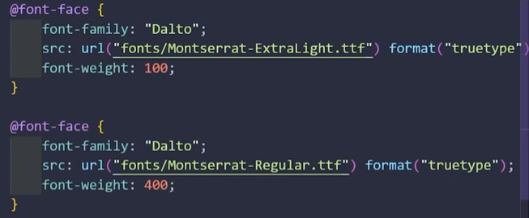

<h1>Extensiones interesantes VSCode</h1>
<u><b>Image Preview</u></b> 
<u><b>Live server</u></b>
 Permite ver tu página web en tiempo real. En la parte de abajo de vsCode (al lado de las líneas) pone un botón Go Live, que abre la página
<h1>CSS</h1>

Para enlazar HTML con CSS se usa el tag link en el head con rel="stylesheet"
  
La sintaxis CSS es la siguiente:
 

tag a modificar
{ 
propiedad : valor<b>;</b> 
propiedad: valor<b>;</b> 
}

El tag a seleccionar se llama <b>selector.</b>
  
En CSS también existe el concepto de <b>clase</b> de POO. El concepto es similar, hacer una plantilla para un elemento en HTML.

Para usar una clase, en el HTML se utiliza el atributo class para decir a qué clase pertenece el elemento, y en CSS se define la clase con un punto delante del nombre, de esta forma:

<b>.</b>clase
{ 
propiedad : valor<b>;</b> 
propiedad: valor<b>;</b> 
}

 
 Además de las clases, existen los <b>id</b>, que están pensados para seleccionar elementos únicos, de forma que <b>uno y sólo uno de los elementos de la página</b> debe tener <b>un id en particular</b>. Su función es identificar al elemento de cara a ser utilizado en código javascript.
 
 Se redefinen en CSS con un # delante en lugar del punto que utilizamos en la clase.

<h2>Propiedades de texto más usadas</h2>

<b>Las propiedades que modifican la posición, tamaño, etc, lo hacen dento del tamaño de su contenedor.</b>

<b>
color
</b>
 
<b>
font-family
</b>
La font que queremos. Si tiene varias palabras el nombre, la ponemos entre comillas como si fuera un string. <b>Podemos poner varias, separadas por comas, y el navegador tratará de cargar la primera, si no puede intentará con la segunda y así sucesivamente.</b>
 
<b>
font-size
</b>
El tamaño del texto, el default es 

16px.
 Se puede medir en px, mm, porcentajes,etc.

<b>
font-weight
</b>
El grosor de la letra. Para poner el texto en negrita se recomienda usar esto con el valor 

bold

en lugar de la etiqueta 
<b>< b>
</b>. Cada font tiene varios niveles de grosor del 100 al 900 y se puede elegir, aunque la mayoría no los tiene todos definidos así que buscará el más próximo.

<b>
font-style
</b>
.La inclinación de la fuente, 

normal < oblique < italic

 Hay una función experimental que permite inclinarla el número de grados que queramos, usando deg. p, ej. 

40deg.

<b>
text-align
</b>
Permite alinear a la izquierda, derecha, centro o justificado.
 
Podemos usar también 

start

o

end
 para adaptar la alineación al idioma del país desde el que se acceda a la página. Por ejemplo, desde un país árabe escogerá 

right

 automáticamente.

<b>
text-decoration
</b>
Es el estilo de subrayado. Se pueden poner varios, por ejemplo tachado y subrayado, además de cambiar el color y grosor de la línea simplemente separando los valores con espacios. <b>NO </b> usar 

blink

, está obsoleta.

<b>
line-height
</b>
Interlineado. 1 es el tamaño de un carácter.

<b>
letter-spacing
</b>
Espaciado entre caracteres. Se usa bastante en botones.

<b>
text-transform
</b>
Transforma el texto a minúscula, mayúscula, o incluso otras opciones especiales, como 

capitalize
, que pone la primera letra de cada palabra en mayúscula, o 

full-size
, para alfabetos especiales como el japonés.

<h1>Workflow</h1>

Para <b>crear un menú navegable </b>creamos una lista sin orden y en cada elemento ponemos un enlace a la página que deseemos.
 
 

<b>Para vincular fuentes de google</b>, nos vamos a google fonts, seleccionamos las que queramos y nos aparece el código html para ponerlo en el head.

Para <b> configurar nuestras propias fuentes</b> creamos otro archivo css en el que definimos la propiedad <b>@font-face</b>, a la cual hay que darle un nombre, el <b>font-family</b> y un <b>src</b>, que sería utilizar la función <b>url</b> con la ruta a la fuente en cuestión y, para que el navegador la cargue más rápido, le decimos el formato con la función <b>format</b>. Si queremos configurar variantes de la misma fuente, cramos diferentes <b>@font-face</b> con la misma family y distintas propiedades.

 Ejemplo:

<h1>Atajos VSCode</h1>
 <u><b>html:5</u></b> Autocompleta la estructura básica de una página web.  
<u><b>a + enter</u></b>
Autocompleta un enlace.
<h1>Tags importantes HTML</h1>
<u><b>< h1></u></b>
 Los h son los títulos. Son importantes porque a nivel de SEO, Google le va a dar más importancia a los h1 que a los h2 y así sucesivamente. Solo se debe utilizar un h1

<u><b>< head></u></b>
Es el header, lo que contiene la información invisible que caracteriza la página.
 
<u><b>
< link 
 
rel href
 >
</u></b>

Se coloca en el head y sirve para enlazar archivos a la página para que los use.
 

rel 

sería la relación que mantiene el archivo con la página. Para enlazar un CSS le damos el valor
 
stylesheet
.
 

href

es la ruta al archivo.

 
<u><b>< title></u></b>
 Va en un head. Es lo que le da el nombre a la pestaña.
 <u><b>< body></u></b>
 Aquí va el contenido de la página.
 Una página se empieza con el tag html y se divide en head y body de esta forma: 
</img>
 <<u><b>< p></u></b>
Párrafo. 
 
<u><b> < strong>
</b></u>

 Usar para las negritas, pues el SEO se va a fijar en esta etiqueta antes que en 
 
 <u><b> 
 < b>.
 </b></u>
 <u><b>< ol></u></b>
Lista ordenada. 
 <u><b>< ul></u></b>
Lista sin orden. Se pueden usar para hacer menús navegables  
<u><b>
< li></u></b>
Dentro de una lista, pone un item.  
<u><b>< a href  target></u></b> 
Enlace. 

href  es el recurso al que lleva el enlace, puede ser una imagen, otra página, etc.<b> Lo va a buscar en local, por lo que si es una página externa hay que añadirle https://</b> Si bien pdemos poner solo //, por motivos de SEO <b>NO</b> se recomienda.
 
 target es la pestaña en la que se abre, _self es en la misma pestaña, _blank es una nueva pestaña o ventana, dependiendo de la configuración del navegador. <b>Se recomienda añadir el atributo rel="noreferrer" en estos casos para evitar que un hacker abuse de la API para abrir pestañas.</b> 
<u><b> 
< img 
 
src alt>
</u></b>

Imagen. 

 
src
es la ruta de la imagen.
 
 alt
es lo que se muestra cuando no carga. Es importante que describa bien la imagen por motivos de SEO.

<u><b> 
< form
 
method

></u></b>

Inicio de un formulario. Dentro irán las etiquetas input.
 
 
method

es el verbo que usa la aplicación web para mandarlo. Puede ser 

get
 o

post

.

<u><b>
 < input
 
type value required name placeholder value minlength maxlength

>
</u></b>

Recoge el input del usuario en función del tipo, que puede ser texto, fechas, números, etc. 
 
value es el texto por defecto. En un botón por ejemplo es el texto del botón. 
  Los tipos más comunes son:
<ul>
<li>

text.

</li>
<li>

email.

Los inputs de tipo submit no lo van a aceptar hasta que no tenga el formato correcto.
</li>
<li>

password.

Oculta con puntos lo que escriba el usuario.
</li>
<li>

checkbox.

Un bool.
</li>
<li>

radio.

Un círculo para seleccionar una opción.
</li>
<li>

file.

Archivo de disco.
</li>
<li>

date.

Una fecha de calentario.
</li>
</ul>
 
required 

hace que elcampo sea obligatorio.
 
 name

es un identificador del campo para una posible aplicación web.
 
 
placeholder

es texto que desaparece del input al escribir algo. Normalmente se utiliza para poner un ejemplo de lo que te está pidiendo.
 
 
value

es a nivel de aplicación web donde se almacenará el valor del input. Como atributo, es el valor por defecto que se le da.
  
minlength y maxlength

Ponen límites inferiores y superiores de número de carácteres.
<h2>Atributos importantes</h2>

<b>title</b>

 crea un recuadro al pasar el ratón por el elemento y muestra el texto que le pongas como valor al atributo. <b>Se suele poner en las imágenes para describirlas y en los enlaces para decir a dónde llevan. También en los campos de los formularios y en los botones.</b>
  

<b>class</b>

le dice al tag que pertenece a una clase de CSS.

<h2>Tags HTML para referenciar CSS</h2>
<u><b>
< span>
</u></b>

Se utiliza para seleccionar partes concretas de nuestro código.

<h1>Listas</h1>
Hay listas ordenadas y sin orden. Se pueden utilizar para menús navegables
<h1>Reglas del buen programador</h1>

Como naming convention, se utiliza una similar a snake case, pero en lugar de barra baja, se utiliza el guión.

  

 En HTML trabajamos de forma semántica y en CSS de forma estética. Es importante que a nivel de SEO nuestro HTML tenga cada tag cumpliendo el rol que se supone que cumple. Un ejemplo de esto es que premia usar < strong> en lugar de < b>

 
 Cada párrafo debe describir algo, por ejemplo, en un blog sobre salud un párrafo puede describir los beneficios del ejercicio físico y otro puede hablar de salud mental.

Por página web solo se utiliza un h1 por motivos de SEO y debe ser lo más descriptivo posible.
 
Por tanto, se deben escribir las páginas con la estructura y la semántica en mente. Un ejemplo es esto:
 
</img>

El atributo 

title  es muy recomendable usarlo para las <b>personas ciegas</b>, pues las páginas leen esta información en voz alta.

En CSS, hay que tener en cuenta que los enlaces deben ser <b>muy reconocibles</b>.

